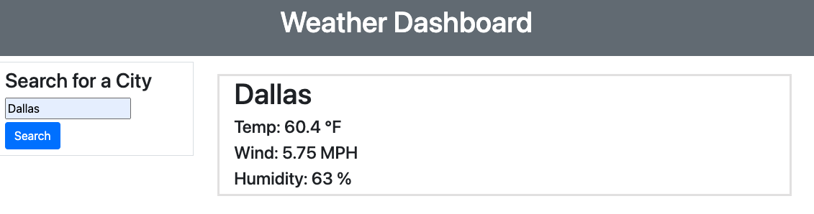

# WeatherDash-ServerSideAPIs

## Description

This was a homework assignment to creat a weather dashboard that displayed weather attributes for a user's selected city. It was build with HTML, CSS, and JS while also incorperation 3rd party APIs.

## Installation

No installation steps are required for this web application to run.

## Usage

    ```md
    
    ```

Link to webpage: https://lhwood.github.io/WeatherDash-ServerSideAPIs/

## Credits

Open Weather was the source for my weather data via their API.

No other resouces to reference outside of class materials.
